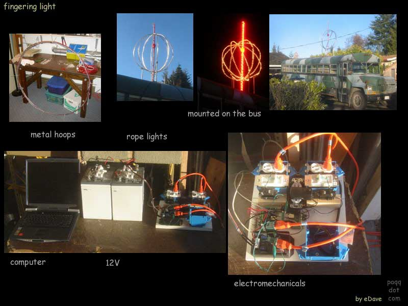
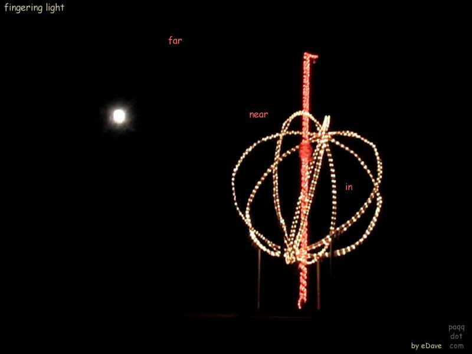
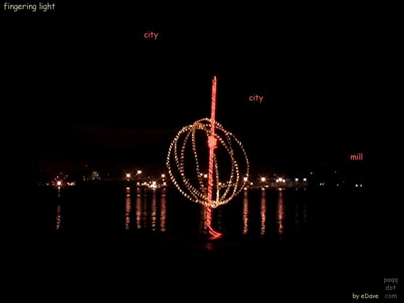

# fingering-light

In 2005 for some maker fun I built a computer controlled lighting display.

There were 3 metal hoops about 4 feet in diameter arranged in a 3d "globe" pattern.
Attached to the hoops were standard christmas lights.
In the middle was a vertical finger, also wrapped with lights.
The lights were powered by a 300W inverter running off a 12V battery.

The control box had some hardware-store slider-type dimmer switches.  
I used servos to move the sliders.  Some of the lights were controlled by electromechanical relays.
It was noisy when operated!

The software was an HTML page running in a C# dashboard. The C# talked to DLL's written in C for controlling Phidgets USB devices.
You built sequences for the light changes by editing trend chart.
Someday if I find the hard disk that has the code on it, I'll post it here.

I put it on top of my old school bus and drove it around town and down to the shore.
The Coast Guard sent over a crew to see what I was doing there.
One doesn't see much like that in our little town.

Here are some pictures in action

Overview of the works.

With the moon in the background.

With the city in the background.

